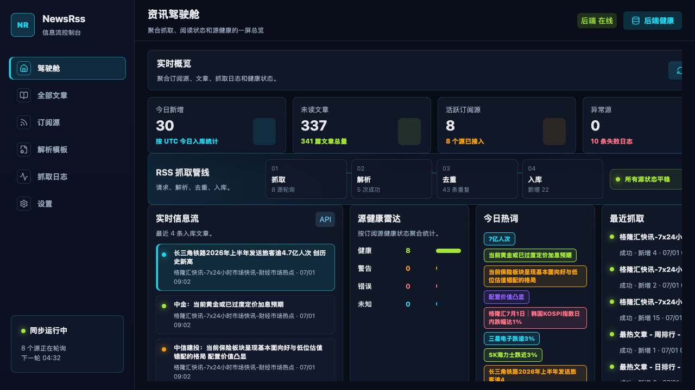
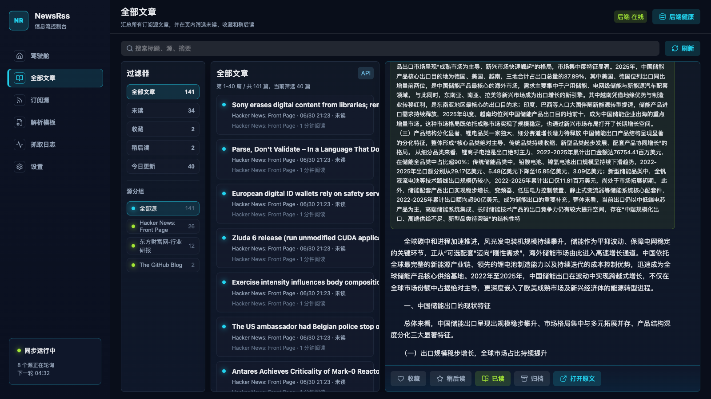
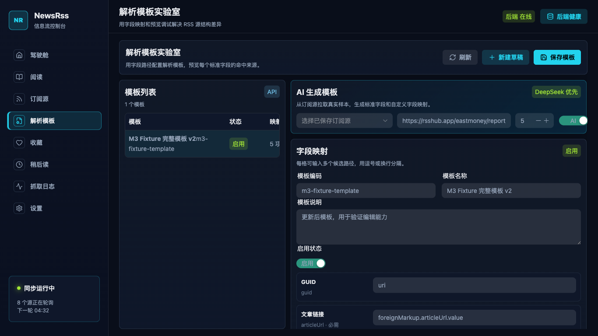
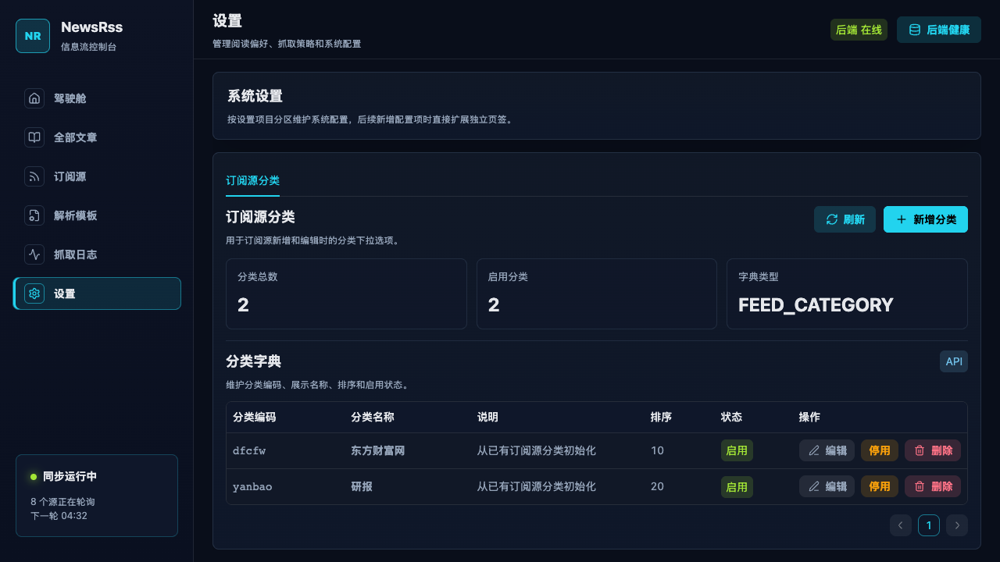

# NewsRss

NewsRss 是一个面向新闻、研报和资讯流的 RSS 订阅、入库与阅读系统。它支持多 RSS 源接入、定时抓取、文章去重、阅读状态管理、抓取日志追踪，以及按订阅源生成解析模板的工作流。

项目采用 Spring Boot + PostgreSQL + Vue 3 + TypeScript + Naive UI 构建，前端可被打包进后端 Jar，适合用一个服务完成部署。



## 功能特性

- **RSS 订阅源管理**：新增、编辑、启停订阅源，支持分类字典和健康状态展示。
- **自动抓取与入库**：后台定时拉取 RSS 内容，按 GUID、链接和指纹去重。
- **阅读工作台**：支持全部文章、未读、今日、收藏、稍后读等筛选，阅读操作区固定在底部。
- **解析模板**：针对不同 RSS 源维护字段映射，支持基于真实 RSS 返回内容生成模板。
- **AI 辅助解析**：可接入 DeepSeek，根据样本 XML 分析标题、链接、摘要、发布时间和自定义字段。
- **抓取日志**：分页查看每次抓取的新增、重复、失败原因和执行时间。
- **系统设置**：以 Tab 方式维护字典配置，当前包含订阅源分类。
- **单 Jar 部署**：执行后端打包时自动构建前端，并将静态文件放入 Spring Boot Jar。

## 界面预览

### 阅读工作台



### 解析模板



### 系统设置



## 技术栈

| 模块 | 技术 |
| --- | --- |
| 后端 | Java 17, Spring Boot 3.5, Spring Web, Spring Data JPA |
| 数据库 | PostgreSQL 16, Flyway |
| RSS 解析 | Rome, Jsoup |
| 前端 | Vue 3, TypeScript, Vite, Pinia, Vue Router |
| UI | Naive UI, Lucide Icons |
| 构建 | Maven, pnpm |

## 目录结构

```text
backend/                 Spring Boot 后端服务
frontend/                Vue 3 + TypeScript 前端
prototype/               早期高保真原型
docs/                    设计文档、变更记录和 README 截图
task.md                  里程碑任务拆解
```

## 环境要求

- Java 17+
- Maven 3.9+
- Node.js 20+
- pnpm 10+
- PostgreSQL 16+

## 配置说明

真实数据库配置文件 `backend/src/main/resources/application-db.yml` 已加入 `.gitignore`，不要提交到 GitHub。

首次运行可以从示例文件复制一份本地配置：

```bash
cp backend/src/main/resources/application-db.example.yml backend/src/main/resources/application-db.yml
```

推荐通过环境变量覆盖数据库和 AI 配置：

```bash
export NEWSRSS_DB_URL=jdbc:postgresql://localhost:5432/newsrss
export NEWSRSS_DB_USERNAME=newsrss
export NEWSRSS_DB_PASSWORD=your_password
export NEWSRSS_DEEPSEEK_ENABLED=false
export NEWSRSS_DEEPSEEK_API_KEY=
```

启用 DeepSeek 解析模板生成时：

```bash
export NEWSRSS_DEEPSEEK_ENABLED=true
export NEWSRSS_DEEPSEEK_API_KEY=your_deepseek_api_key
export NEWSRSS_DEEPSEEK_MODEL=deepseek-v4-pro
```

## 本地开发

### 1. 准备 PostgreSQL

使用 Docker 创建本地测试数据库：

```bash
docker run --name newsrss-postgres \
  -e POSTGRES_DB=newsrss \
  -e POSTGRES_USER=newsrss \
  -e POSTGRES_PASSWORD=newsrss \
  -p 15432:5432 \
  -v newsrss_postgres_data:/var/lib/postgresql/data \
  -d postgres:16-alpine
```

后续复用容器：

```bash
docker start newsrss-postgres
```

连接信息：

```text
JDBC URL: jdbc:postgresql://localhost:15432/newsrss
Username: newsrss
Password: newsrss
```

### 2. 启动后端

```bash
NEWSRSS_DB_URL=jdbc:postgresql://localhost:15432/newsrss \
NEWSRSS_DB_USERNAME=newsrss \
NEWSRSS_DB_PASSWORD=newsrss \
mvn -f backend/pom.xml spring-boot:run -Dspring-boot.run.profiles=db
```

健康检查：

```bash
curl http://localhost:8080/api/health
```

### 3. 启动前端

```bash
pnpm install
pnpm frontend:dev
```

默认访问：

```text
http://localhost:5173
```

## 单 Jar 部署

生产或服务器测试推荐使用单 Jar。打包时 Maven 会自动执行前端构建，并把 `frontend/dist` 放进后端静态资源目录。

```bash
mvn -f backend/pom.xml package -DskipTests
```

产物路径：

```text
backend/target/newsrss-backend-0.0.1-SNAPSHOT.jar
```

服务器启动示例：

```bash
SPRING_PROFILES_ACTIVE=db \
NEWSRSS_DB_URL=jdbc:postgresql://localhost:5432/newsrss \
NEWSRSS_DB_USERNAME=newsrss \
NEWSRSS_DB_PASSWORD=your_password \
NEWSRSS_DEEPSEEK_ENABLED=false \
NEWSRSS_BACKEND_PORT=8080 \
java -jar newsrss-backend-0.0.1-SNAPSHOT.jar
```

启动后访问：

```text
http://服务器IP:8080
```

Vue 路由刷新已由后端转发支持，例如 `/reader`、`/feeds`、`/parser-templates`、`/fetch-logs`、`/settings`。

## 数据库迁移

项目使用 Flyway 管理数据库结构。服务器上需要先创建数据库 `newsrss`，表结构会在应用启动时自动迁移。

当前迁移文件位于：

```text
backend/src/main/resources/db/migration/
```

开发规则：

- SQL 变更必须新增迁移文件，不修改已执行过的历史 SQL。
- 新增表字段需要在 SQL 中追加字段注释。
- 代码逻辑变更需要在 `docs/` 目录追加变更记录。

## 验证命令

```bash
NEWSRSS_DB_URL=jdbc:postgresql://localhost:15432/newsrss \
NEWSRSS_DB_USERNAME=newsrss \
NEWSRSS_DB_PASSWORD=newsrss \
mvn -f backend/pom.xml test
```

```bash
pnpm frontend:build
```

```bash
mvn -f backend/pom.xml package -DskipTests
```

RSS 抓取冒烟验证：

```bash
NEWSRSS_DB_URL=jdbc:postgresql://localhost:15432/newsrss \
NEWSRSS_DB_USERNAME=newsrss \
NEWSRSS_DB_PASSWORD=newsrss \
mvn -f backend/pom.xml spring-boot:run \
  -Dspring-boot.run.profiles=db \
  -Dspring-boot.run.arguments="--spring.main.web-application-type=none --newsrss.fetch.smoke.enabled=true --newsrss.fetch.smoke.urls[0]=https://hnrss.org/frontpage --newsrss.fetch.smoke.urls[1]=https://github.blog/feed/"
```

## 开源前检查

提交前建议确认没有本地密钥、构建产物和运行日志：

```bash
rg -n "sk-[A-Za-z0-9_-]+|password:|api-key:" . \
  -g '!backend/src/main/resources/application-db.yml' \
  -g '!backend/src/main/resources/application-dev.yml' \
  -g '!node_modules/**' \
  -g '!frontend/dist/**' \
  -g '!backend/target/**'
```

`.gitignore` 已忽略：

- `backend/src/main/resources/application-db.yml`
- `backend/src/main/resources/application-dev.yml`
- `backend/target/`
- `frontend/dist/`
- `node_modules/`
- `.playwright-cli/`
- 运行日志和本地 IDE 文件

## Roadmap

- 后端关键词服务，替换当前前端轻量热词统计。
- 更完整的中文分词和主题聚类。
- 多用户账号、订阅源共享和权限隔离。
- 解析模板版本管理和模板市场。
- 前端路由级代码分包，优化生产包体积。

## License

暂未指定许可证。开源前建议补充 `LICENSE`，例如 MIT 或 Apache-2.0。
